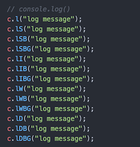
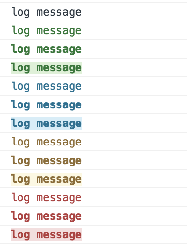
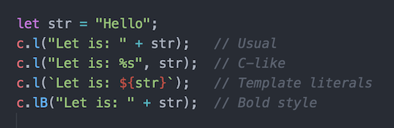
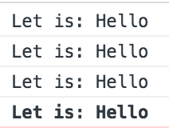

# smart-console

Simple JavaScript library that provides shortcuts to manage the console methods and to add bold style and colors.
Suitable for browsers and for NodeJS.

Every console object method (for more info see: [MDN](https://developer.mozilla.org/en/docs/Web/API/console) and
[Google API](https://developers.google.com/web/tools/chrome-devtools/console/console-reference)) has a name shortcut and predefined colors can be added to the log() messages:
* Success (green)
* Info  (blue)
* Warning   (yellow)
* Danger    (red)

__The script can have different effects based on the browser used__

File explanation:
* index.html - list of examples
* browser folder - it has 2 files suitable to be used on a browser, one is normal and one minify
* nodejs folder - it has the NodeJS module and the package.json

## How to use it:
### Browser version
Insert the library as usual:
> 

Write 'c' instead of 'console' and use one of the method shortcuts.  

Write the shortcut for the console method and check the console:

If you forget the shortcuts' name:
> c.l(c);

For the log() messages you can use 3 different ways to insert a variable and you can give a bold style:

#### Colors
You can add 4 default colors for the text and the background and the bold formatting.

Colors are available only for log().

How to add colors (see above image):
* Green = Success -> Add 'S' for just green text, add 'B' for bold text, add 'BG' for green in background
* Blue = Info -> Add 'I' for just blue text, add 'B' for bold text, add 'BG' for blue in background
* Amber = Warning -> Add 'W' for just amber text, add 'B' for bold text, add 'BG' for amber in background
* Red = Danger -> Add 'D' for just red text, add 'B' for bold text, add 'BG' for red in background

__Style can be added only to the whole message__

### NodeJS version
Insert the module as usual:
> const {c} = require("./smart-console.js");

Follow the same instructions for the browser version, the bold style is not supported.

