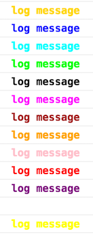

# smart-console

Simple JavaScript library that provides shorthand methods to manage console output with 0 dependencies. Customize your console output with different colors and formats style. Manage the new Performance Object.

You can find the same library for the NodeJS [here](https://github.com/achille1789/smart-console-nodejs).

Every console object method (for more info see: [MDN](https://developer.mozilla.org/en/docs/Web/API/console) and
[Google API](https://developers.google.com/web/tools/chrome-devtools/console/console-reference)) has a name shortcut and predefined colors can be added to the log() messages.

## Version 4.0

__The script can have different effects based on the browser used__

## Files explanation:
* index.html - list of examples
* 2 files suitable to be used on a browser, one is normal and one minify

## How to use it:
Insert the library as usual:
```javascript
<script src="smart-console.js"></script>
```
Write 'c' instead of 'console' and use one of the method shortcuts. For example:
```javascript
console.log('test');
```
Becomes:
```javascript
c.l('test');
```

### Shorthands for console methods
All the shorthand methods use lower case
```javascript
c.a() = console.assert()
c.cl() = console.clear()
c.c() = console.count()
c.d() = console.debug()
c.dir() = console.dir()
c.dx() = console.dirxml()
c.e() = console.error()
c.g() = console.group()
c.gc() = console.groupCollapsed()
c.ge() = console.groupEnd()
c.i() = console.info()
c.l() = console.log()
c.p() = console.profile()
c.pe() = console.profileEnd()
c.tb() = console.table()
c.t() = console.time()
c.te() = console.timeEnd()
c.ts() = console.timeStamp()
c.tr() = console.trace()
c.w() = console.warn()
c.j() = console.log() for logging JavaScript JSON objects
```

For log() messages you can use 3 different ways to insert a variable:
```javascript
let str = "Awesome";
c.l("Smart Console is " + str);
c.l("Smart Console is %s", str);
c.l(`Smart Console is ${str}`);
```

The new method j() can be used to log JS and JSON objects using JSON.stringify
```javascript
var jsonObj = {"pas": "rex", "pas1": "rex", "pas2": "rex", "pas3": "rex"};
c.j(jsonObj);
{
    "pas": "rex",
    "pas1": "rex",
    "pas2": "rex",
    "pas3": "rex"
}
var jsObj = {pas: "rex", pas1: "rex", pas2: "rex", pas3: "rex"};
c.j(jsObj);
{
    "pas": "rex",
    "pas1": "rex",
    "pas2": "rex",
    "pas3": "rex"
}
```
A second parameter can be added to insert white spaces. By default they are set to 4
```javascript
var jsonObj = {"pas": "rex", "pas1": "rex", "pas2": "rex", "pas3": "rex"};
c.j(jsonObj, 2);
{
  "pas": "rex",
  "pas1": "rex",
  "pas2": "rex",
  "pas3": "rex"
}
```

### Performance object
```javascript
p.m = performance.mark()
p.n = performance.now()
p.t = performance.timing
```

```javascript
var t1 = p.n();
for (let i = 0; i < 15000; i++) {
    var loop = i;
}
var t2 = p.n();
c.l("Call to do the loop took " + (t2 - t1) + " milliseconds.");

var timing = p.t;
```


### Format styles for log() method
Format styles use lower case
```javascript
c.lb() = bold
c.lu() = underline
c.lt() = line-through
c.li() = italic
c.ls() = size 200%
```


### Colors for log() method
Colors use upper case
```javascript
c.lA("text") amber/gold
c.lB("text") blue
c.lC("text") cyan
c.lG("text") green
c.lK("text") black
c.lM("text") magenta
c.lN("text") brown
c.lO("text") orange
c.lP("text") pink
c.lR("text") red
c.lU("text") purple
c.lW("text") white
c.lY("text") yellow
```

### Bold + Colors for log() method
Format styles use lower case and Colors use upper case
```javascript
c.lbA("text") bold + amber/gold
c.lbB("text") bold + blue
c.lbC("text") bold + cyan
c.lbG("text") bold + green
c.lbK("text") bold + black
c.lbM("text") bold + magenta
c.lbN("text") bold + brown
c.lbO("text") bold + orange
c.lbP("text") bold + pink
c.lbR("text") bold + red
c.lbU("text") bold + purple
c.lbW("text") bold + white
c.lbY("text") bold + yellow
```

### Underline + Bold + Colors for log() method
Format styles use lower case and Colors use upper case, bold style is added by default
```javascript
c.luA("text") underline + bold + amber/gold
c.luB("text") underline + bold + blue
c.luC("text") underline + bold + cyan
c.luG("text") underline + bold + green
c.luK("text") underline + bold + black
c.luM("text") underline + bold + magenta
c.luN("text") underline + bold + brown
c.luO("text") underline + bold + orange
c.luP("text") underline + bold + pink
c.luR("text") underline + bold + red
c.luU("text") underline + bold + purple
c.luW("text") underline + bold + white
c.luY("text") underline + bold + yellow
```

### line-through + Bold + Colors for log() method
Format styles use lower case and Colors use upper case, bold style is added by default
```javascript
c.ltA("text") line-through + bold + amber/gold
c.ltB("text") line-through + bold + blue
c.ltC("text") line-through + bold + cyan
c.ltG("text") line-through + bold + green
c.ltK("text") line-through + bold + black
c.ltM("text") line-through + bold + magenta
c.ltN("text") line-through + bold + brown
c.ltO("text") line-through + bold + orange
c.ltP("text") line-through + bold + pink
c.ltR("text") line-through + bold + red
c.ltU("text") line-through + bold + purple
c.ltW("text") line-through + bold + white
c.ltY("text") line-through + bold + yellow
```

### italic + Bold + Colors for log() method
Format styles use lower case and Colors use upper case, bold style is added by default
```javascript
c.liA("text") italic + bold + amber/gold
c.liB("text") italic + bold + blue
c.liC("text") italic + bold + cyan
c.liG("text") italic + bold + green
c.liK("text") italic + bold + black
c.liM("text") italic + bold + magenta
c.liN("text") italic + bold + brown
c.liO("text") italic + bold + orange
c.liP("text") italic + bold + pink
c.liR("text") italic + bold + red
c.liU("text") italic + bold + purple
c.liW("text") italic + bold + white
c.liY("text") italic + bold + yellow
```

### size 200% + Bold + Colors for log() method
Format styles use lower case and Colors use upper case, bold style is added by default
```javascript
c.lsA("text") size 200% + bold + amber/gold
c.lsB("text") size 200% + bold + blue
c.lsC("text") size 200% + bold + cyan
c.lsG("text") size 200% + bold + green
c.lsK("text") size 200% + bold + black
c.lsM("text") size 200% + bold + magenta
c.lsN("text") size 200% + bold + brown
c.lsO("text") size 200% + bold + orange
c.lsP("text") size 200% + bold + pink
c.lsR("text") size 200% + bold + red
c.lsU("text") size 200% + bold + purple
c.lsW("text") size 200% + bold + white
c.lsY("text") size 200% + bold + yellow
```




### Background Color + Bold for log() method
Background Colors use upper case, bold style is added by default
```javascript
c.lABG("text") background color + bold + amber/gold
c.lBBG("text") background color + bold + blue
c.lCBG("text") background color + bold + cyan
c.lGBG("text") background color + bold + green
c.lKBG("text") background color + bold + black
c.lMBG("text") background color + bold + magenta
c.lNBG("text") background color + bold + brown
c.lOBG("text") background color + bold + orange
c.lPBG("text") background color + bold + pink
c.lRBG("text") background color + bold + red
c.lUBG("text") background color + bold + purple
c.lWBG("text") background color + bold + white
c.lYBG("text") background color + bold + yellow
```

### size 200% + Background Color + Bold for log() method
Format styles use lower case and Background Colors use upper case, bold style is added by default
```javascript
c.lsABG("text") size 200% + background color + bold + amber/gold
c.lsBBG("text") size 200% + background color + bold + blue
c.lsCBG("text") size 200% + background color + bold + cyan
c.lsGBG("text") size 200% + background color + bold + green
c.lsKBG("text") size 200% + background color + bold + black
c.lsMBG("text") size 200% + background color + bold + magenta
c.lsNBG("text") size 200% + background color + bold + brown
c.lsOBG("text") size 200% + background color + bold + orange
c.lsPBG("text") size 200% + background color + bold + pink
c.lsRBG("text") size 200% + background color + bold + red
c.lsUBG("text") size 200% + background color + bold + purple
c.lsWBG("text") size 200% + background color + bold + white
c.lsYBG("text") size 200% + background color + bold + yellow
```


__If you forget the shortcuts' name:__
```javascript
> c.l(c);
```

[For Issues](https://github.com/achille1789/smart-console/issues)

[](https://github.com/achille1789/smart-console/blob/master/LICENSE)
