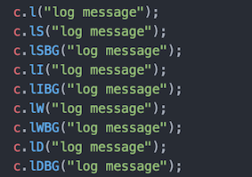
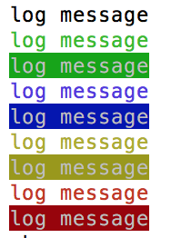
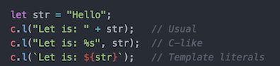
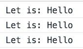

# smart-console

Simple JavaScript library that provides shorthand methods to manage console output with 0 dependencies. Customize your console output with different colors.

Every console object method (for more info see: [MDN](https://developer.mozilla.org/en/docs/Web/API/console) and
[Google API](https://developers.google.com/web/tools/chrome-devtools/console/console-reference)) has a name shortcut and predefined colors can be added to the log() messages:
* Success   (green)
* Info      (blue)
* Warning   (yellow)
* Danger    (red)


## How to use it:
Insert the library as usual:
```
npm install --save smart-console
```
```
const {c} = require("smart-console");
```
Write 'c' instead of 'console' and use one of the method shortcuts. For example:
```
console.log('test');
```
Becomes
```
c.l('test');
```

.

Write the shortcut for the console method and check the console:




If you forget the shortcuts' name:
> c.l(c);

For the log() messages you can use 3 different ways to insert a variable:




#### Colors
You can add 4 default colors for the text and the background.

Colors are available only for log().

How to add colors (see above image):
* Green = Success -> Add 'S' for just green text, add 'BG' for green background
* Blue = Info -> Add 'I' for just blue text, add 'BG' for blue background
* Amber = Warning -> Add 'W' for just amber text, add 'BG' for amber background
* Red = Danger -> Add 'D' for just red text, add 'BG' for red background

__Style can be added only to the whole message__

[Git Hub Repository](https://github.com/achille1789/smart-console.git)

[For Issues](https://github.com/achille1789/smart-console/issues)

[](https://github.com/achille1789/smart-console/blob/master/LICENSE)
